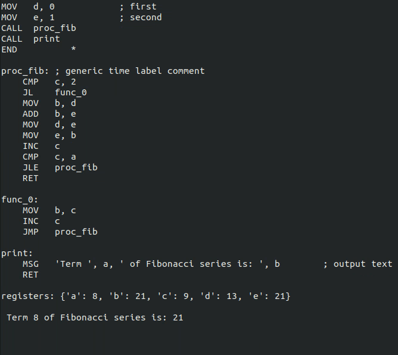

# Assembler Interpreter
This is a program designed to interpret basic [Assembler](https://en.wikipedia.org/wiki/Assembly_language) code.
## What is an interpreter ?
An interpreter is a computer program that is used to directly execute program instructions written using one of the many high-level programming languages.
## Visuals
If specified, this program also provides some visuals that follow the calculations that the program makes. In each line, we print the input code together with a star simbol (*) that indicates which line the program is analysing. Below this we print all the registers the program has stored.

Here is an example video

  

## How to use it?
1. Code -> Download zip.
2. Extract into a folder.
3. Open the program "main.py"
4. Write your own assembly code in the string **program**.
5. Go to a terminal and cd into the folder that has the main.py file.
6. Type the command "python3 main.py [timer]", where [timer] is the amount of time you wish the program to stop executing between lines (the default is 1 second).

***Note***: If your program is too big, it may not fit into the screen.
